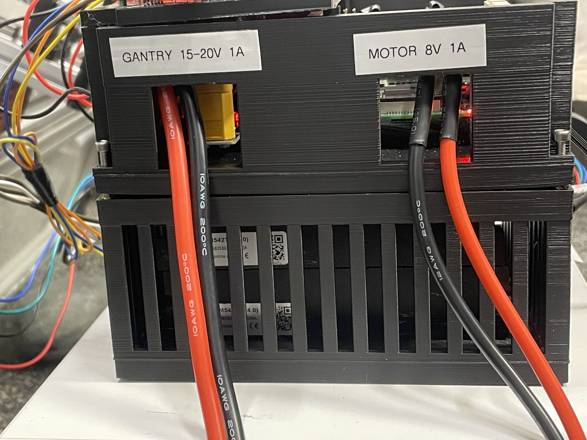
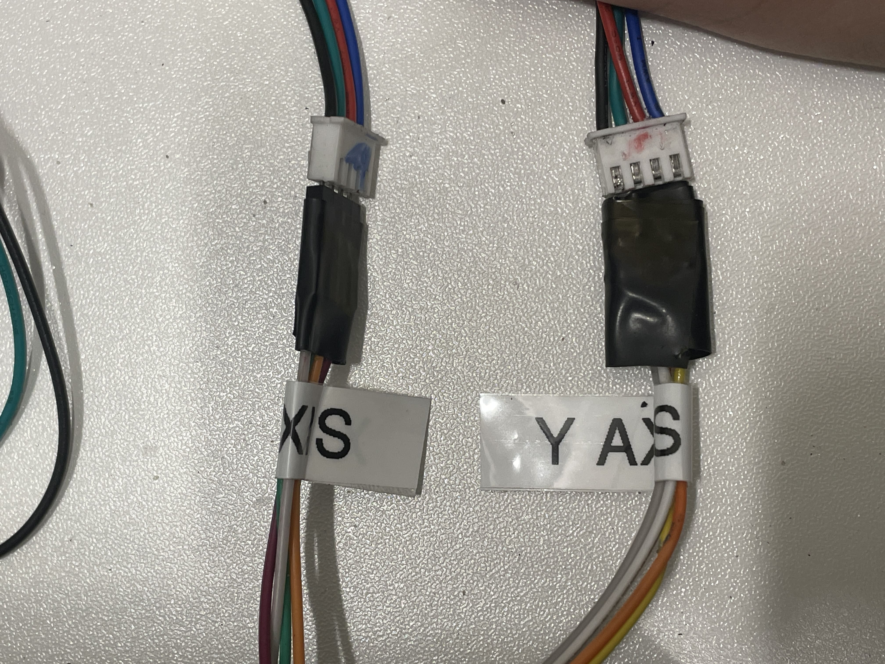
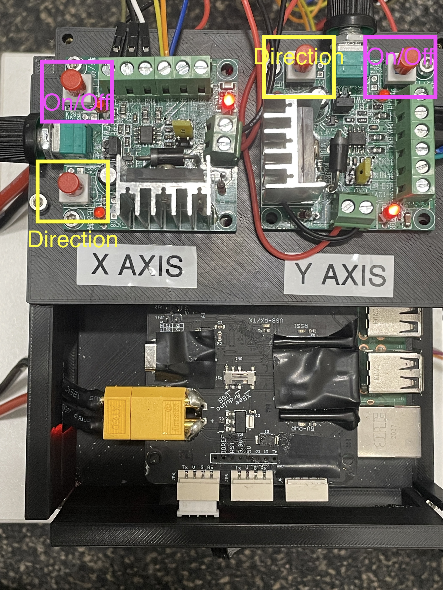

# Gantry System (v0.1) Instruction
The system is divied into two parts: gantry and motor. 

Checklist:
1. Check the figures before running
2. Be careful for the wire connection, make sure use the power bank rather battery while testing
3. Install librealsense for depth camera [installation guide](https://github.com/IntelRealSense/librealsense/blob/master/doc/installation.md)

## 1. Overview
### Overview

### Power Holes

## 2. Gantry
**Power:** 15v ~ 20v, 1A

### Gantry Cable Connection

The wires should be marked already. To double check, please make sure the marked sides are aligned for both X and Y Axis

### XY Axis Controller

The rotatory knob is for speed control
Purple Box indicates its for on/off of the motor 
Yellow Box indicates its for direction of the motor

## 3. Motor
**Power:** 8v, 1A
For now, the motor control is provided by an external robot because a missing component. Will implement ASAP when package arrived. The code will also update soon.
